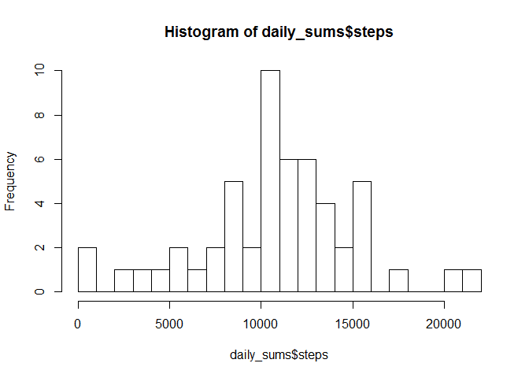

# Reproducible Research: Peer Assessment 1


## Loading and preprocessing the data

```r
activity_data <- read.csv("activity.csv") 
date <- as.Date(activity_data$date)
activity_data$date <- date
```

## What is mean total number of steps taken per day?

```r
mean_total = sum(activity_data$steps, na.rm = TRUE) / (nrow(table(activity_data$date)))

daily_sums <- aggregate(.~date, data = activity_data, sum)
mean(daily_sums$steps)
```

```
## [1] 10766.19
```

```r
median(daily_sums$steps)
```

```
## [1] 10765
```

```r
hist(daily_sums$steps, breaks = 20)
```

<!-- -->


## What is the average daily activity pattern?


## Imputing missing values


## Are there differences in activity patterns between weekdays and weekends?
