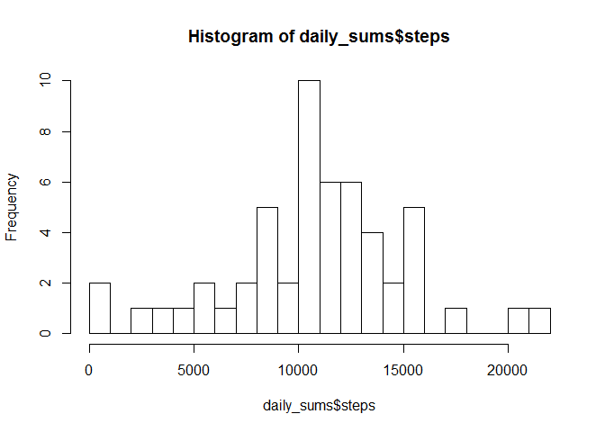
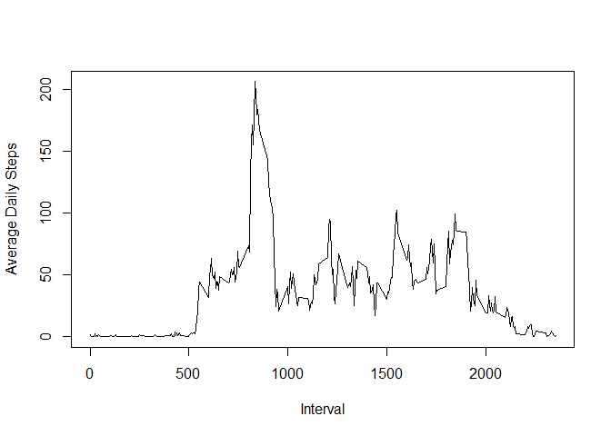
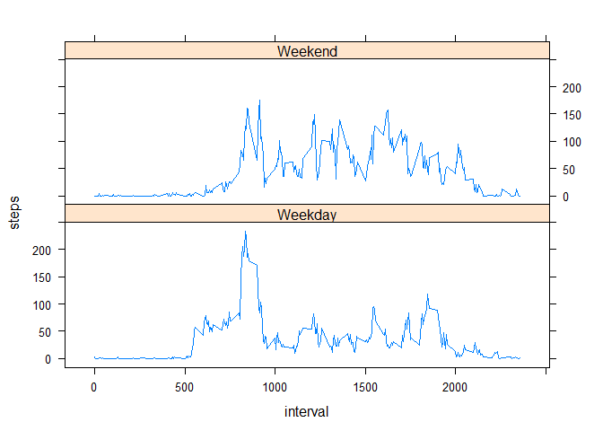

# Reproducible Research: Peer Assessment 1


## Loading and preprocessing the data

```r
activity_data <- read.csv("activity.csv") 
date <- as.Date(activity_data$date)
activity_data$date <- date
```

## What is mean total number of steps taken per day?

```r
mean_total = sum(activity_data$steps, na.rm = TRUE) / (nrow(table(activity_data$date)))

daily_sums <- aggregate(.~date, data = activity_data, sum)
mean(daily_sums$steps)
```

```
## [1] 10766.19
```

```r
median(daily_sums$steps)
```

```
## [1] 10765
```

```r
hist(daily_sums$steps, breaks = 20)
```

<!-- -->


## What is the average daily activity pattern?

```r
daily_means <- tapply(activity_data$steps, activity_data$interval, mean, na.rm = TRUE)

interval_names <- names(daily_means)

plot(interval_names, daily_means, type = "l" , xlab= "Interval", ylab = "Average Daily Steps")
```

<!-- -->

```r
cat("The max interval is the" , names(which.max(daily_means)), "minute interval")
```

```
## The max interval is the 835 minute interval
```


## Imputing missing values

```r
num_na <- sum(is.na(activity_data)) 
cat("The number of NAs in the data is", num_na)   
```

```
## The number of NAs in the data is 2304
```

```r
filled <- numeric()
for (i in 1:nrow(activity_data)){
    data <- activity_data[i,]
    if(is.na(data$steps)){
        steps <- subset(daily_means, names(daily_means) == data$interval)     } else{
            steps <- data$steps
        }
    filled <- c(filled, steps)
}
```
## Are there differences in activity patterns between weekdays and weekends?

```r
day_type <-  character()
for(i in 1:nrow(activity_data)){
    if (weekdays(activity_data$date[i]) == "Sunday" | weekdays(activity_data$date[i]) == "Saturday"){
        day_type[i] <- "Weekend"
    } else{
        day_type[i] <- "Weekday"
    }
}
activity_data$day_type <- day_type
library(lattice)
average_steps_daily <- aggregate(steps ~ interval + day_type, data = activity_data, mean)
xyplot(steps ~ interval | day_type, average_steps_daily, type = "l", layout=c(1,2))
```

<!-- -->
